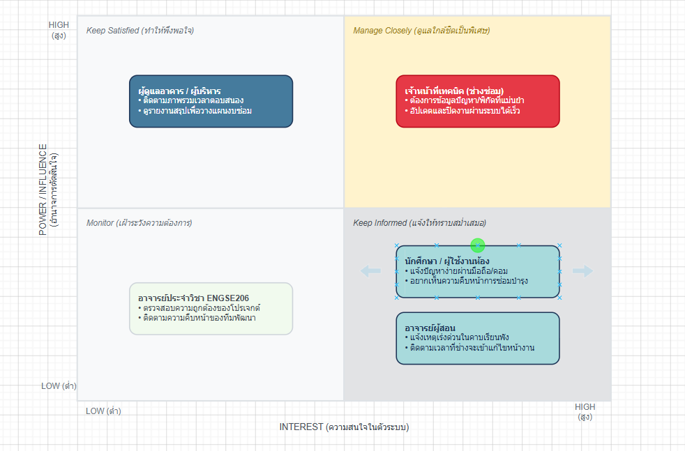
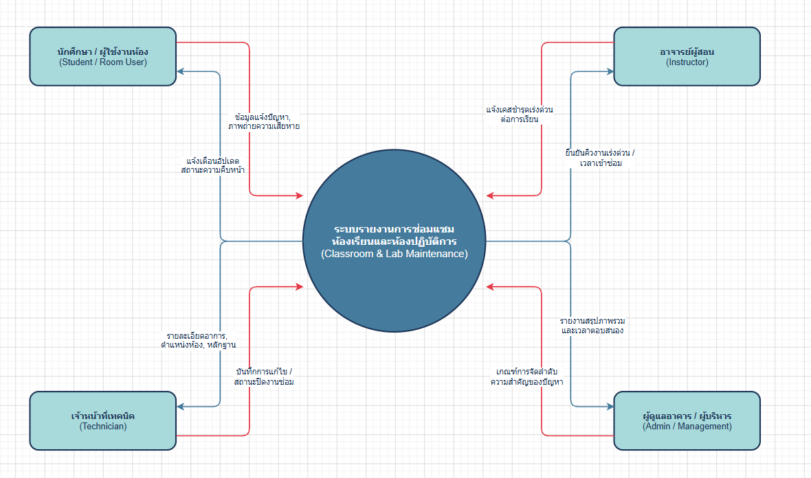

# Week 02 — Stakeholder, Context and Scope

> **Team:** Group 02 — Classroom & Lab Maintenance Reporting System (CLMRS)  
> **Case:** ระบบแจ้งซ่อมและติดตามการบำรุงรักษาห้องเรียนและห้องปฏิบัติการในมหาวิทยาลัย  
> **Version:** v0.1 (Draft)  
> **Last updated:** 13/07/2026  
> **Diagram source of truth:** Draw.io files in `diagrams/`

---

# 1. Problem Frame (Revised)

## 1.1 Current Situation

ปัจจุบันการแจ้งปัญหาภายในห้องเรียนและห้องปฏิบัติการ เช่น โปรเจกเตอร์เสีย เครื่องปรับอากาศไม่ทำงาน คอมพิวเตอร์ชำรุด หรืออุปกรณ์เครือข่ายมีปัญหา ยังใช้การแจ้งผ่านหลายช่องทาง เช่น การแจ้งเจ้าหน้าที่โดยตรง โทรศัพท์ ทำให้ข้อมูลกระจัดกระจาย ติดตามสถานะได้ยาก และเกิดความล่าช้าในการซ่อมบำรุง

ผู้แจ้งไม่สามารถทราบได้ว่างานได้รับการดำเนินการถึงขั้นตอนไหน ส่วนเจ้าหน้าที่ต้องตรวจสอบข้อมูลจากหลายแหล่ง ทำให้เกิดงานซ้ำและยากต่อการจัดลำดับความสำคัญของงาน

---

## 1.2 Who is Affected?

- **นักศึกษา**
  - ไม่สามารถใช้งานห้องเรียนหรือห้องปฏิบัติการได้ตามปกติ
  - ไม่ทราบสถานะการแจ้งซ่อม

- **อาจารย์**
  - การเรียนการสอนอาจหยุดชะงักเมื่ออุปกรณ์เสีย
  - ต้องเสียเวลาแจ้งปัญหาหลายครั้ง

- **เจ้าหน้าที่ซ่อมบำรุง**
  - รับข้อมูลจากหลายช่องทาง
  - ติดตามงานและจัดลำดับความสำคัญได้ยาก

- **ผู้ดูแลระบบ**
  - ต้องดูแลข้อมูลผู้ใช้และสิทธิ์การเข้าถึง
  - ต้องรักษาความปลอดภัยของข้อมูล

- **ผู้บริหารคณะ**
  - ไม่มีข้อมูลภาพรวมของการซ่อมบำรุง
  - ยากต่อการวางแผนงบประมาณและการปรับปรุง

---

## 1.3 Problem Statement

> กระบวนการแจ้งซ่อมและติดตามงานซ่อมของห้องเรียนและห้องปฏิบัติการยังไม่มีระบบกลางในการจัดการข้อมูล ทำให้เกิดความล่าช้า การสื่อสารไม่ต่อเนื่อง การติดตามสถานะทำได้ยาก และผู้เกี่ยวข้องไม่สามารถมองเห็นภาพรวมของงานซ่อมได้อย่างมีประสิทธิภาพ

---

## 1.4 Desired Outcomes

- ผู้ใช้สามารถแจ้งปัญหาได้สะดวกผ่านระบบเดียว
- เจ้าหน้าที่ได้รับข้อมูลครบถ้วนและจัดลำดับงานได้ง่าย
- ผู้แจ้งสามารถติดตามสถานะงานได้แบบ Real-time
- ผู้บริหารสามารถดูรายงานและสถิติการซ่อมบำรุง
- ลดระยะเวลาในการสื่อสารและดำเนินการซ่อม

---

## 1.5 What the Team Still Needs to Learn

- ระดับความเร่งด่วนของแต่ละประเภทปัญหาควรแบ่งอย่างไร
- ใครเป็นผู้รับผิดชอบแต่ละอาคารหรือห้องปฏิบัติการ
- ขั้นตอนการอนุมัติการซ่อมมีหรือไม่
- ระบบแจ้งเตือนควรส่งผ่านช่องทางใด
- รายงานใดที่ผู้บริหารต้องการมากที่สุด

---

# 2. Stakeholder Inventory and Map

> **Source:** `diagrams/stakeholders/w02-stakeholder-map.drawio`

| Stakeholder | Role | Goal / Need | Influence | Interest | Why it Matters |
|---|---|---|---|---|---|
| นักศึกษา | แจ้งปัญหาและติดตามสถานะ | แจ้งปัญหาได้ง่ายและทราบความคืบหน้า | Medium | High | ผู้ใช้งานหลักของระบบ |
| อาจารย์ | แจ้งปัญหาในห้องเรียน | ต้องการให้อุปกรณ์พร้อมใช้งาน | Medium | High | ส่งผลต่อการเรียนการสอน |
| เจ้าหน้าที่ซ่อมบำรุง | รับงานและอัปเดตสถานะ | จัดลำดับงานและบันทึกผลการซ่อม | High | High | ผู้ดำเนินงานหลัก |
| ผู้ดูแลระบบ | จัดการข้อมูลและสิทธิ์ | ดูแลผู้ใช้ ระบบ และฐานข้อมูล | High | Medium | ดูแลความปลอดภัยของระบบ |
| ผู้บริหาร | ดูรายงานและสถิติ | วางแผนงบประมาณและประเมินผล | High | Medium | ผู้กำหนดนโยบาย |
| Email/Notification Service | ส่งการแจ้งเตือน | แจ้งสถานะงาน | Low | Low | ระบบภายนอก |

---

## 2.1 Stakeholder Profiles

### นักศึกษา

**Goal**

- แจ้งปัญหาได้ง่าย
- ติดตามสถานะได้

**Pain Point**

- ไม่รู้ว่างานดำเนินการถึงไหน
- ต้องแจ้งหลายช่องทาง

**Influence**

Medium

**Open Questions**

- ต้องการแจ้งผ่านมือถือหรือเว็บไซต์
- ต้องการแจ้งเตือนแบบใด

---

### อาจารย์

**Goal**

- ห้องเรียนพร้อมใช้งานก่อนเริ่มสอน

**Pain Point**

- แจ้งปัญหาแล้วไม่ทราบผล

**Influence**

Medium

---

### เจ้าหน้าที่ซ่อมบำรุง

**Goal**

- รับงาน
- อัปเดตสถานะ
- ปิดงาน

**Pain Point**

- งานจำนวนมาก
- ข้อมูลไม่ครบ

**Influence**

High

---

### ผู้ดูแลระบบ

**Goal**

- จัดการผู้ใช้
- กำหนดสิทธิ์
- ดูแลระบบ

**Pain Point**

- ต้องรักษาความปลอดภัยของข้อมูล

---

### ผู้บริหาร

**Goal**

- ดูรายงาน
- ประเมินประสิทธิภาพ

**Pain Point**

- ไม่มี Dashboard

---

# 3. System Context

> **Source:** `diagrams/context/w02-system-context.drawio`

## 3.1 System Boundary

ระบบ CLMRS ครอบคลุม

- Login
- แจ้งซ่อม
- แนบรูปภาพ
- จัดการรายการแจ้งซ่อม
- อัปเดตสถานะ
- แจ้งเตือน
- Dashboard

ระบบ **ไม่ครอบคลุม**

- ระบบจัดซื้อ
- ระบบคลังอะไหล่
- ระบบการเงิน
- ระบบซ่อมบำรุงอัตโนมัติ

---

## 3.2 Key Data Flows

| From → To | Data |
|---|---|
| นักศึกษา → ระบบ | รายละเอียดปัญหา รูปภาพ |
| อาจารย์ → ระบบ | แจ้งซ่อม |
| ระบบ → เจ้าหน้าที่ | รายการงานใหม่ |
| เจ้าหน้าที่ → ระบบ | อัปเดตสถานะ |
| ระบบ → ผู้แจ้ง | แจ้งเตือนสถานะ |
| ผู้บริหาร ↔ ระบบ | รายงานและสถิติ |
| ระบบ ↔ Email Service | Notification |

---

# 4. Scope Statement

## In Scope

1. Login
2. User Management
3. แจ้งปัญหา
4. แนบรูปภาพ
5. กำหนดประเภทปัญหา
6. ติดตามสถานะ
7. มอบหมายงาน
8. Dashboard
9. รายงานสถิติ
10. Notification

---

## Out of Scope

1. Mobile Application
2. ระบบจัดซื้อ
3. ระบบคลังอะไหล่
4. ระบบการเงิน
5. AI วิเคราะห์การเสียหาย

---

## Constraints

- พัฒนาเป็น Web Application
- ใช้ภายในมหาวิทยาลัย
- ระยะเวลาพัฒนา 1 ภาคการศึกษา
- ทีมพัฒนา 3–4 คน
- ใช้ฐานข้อมูลกลางเพียงชุดเดียว

---

## Assumptions

- ผู้ใช้ทุกคนมีบัญชีมหาวิทยาลัย
- เจ้าหน้าที่ทุกคนสามารถเข้าถึงระบบได้
- มีอินเทอร์เน็ตภายในมหาวิทยาลัย
- ทุกห้องมีรหัสห้องที่ชัดเจน

---

## Open Questions

| ID | Question | Priority |
|---|---|---|
| OQ-01 | ปัญหาแต่ละประเภทควรมี SLA เท่าไร | High |
| OQ-02 | ใครเป็นผู้รับผิดชอบแต่ละอาคาร | High |
| OQ-03 | ต้องมีการอนุมัติก่อนซ่อมหรือไม่ | Medium |
| OQ-04 | ต้องแจ้งเตือนผ่าน Email หรือ LINE | Medium |
| OQ-05 | Dashboard ควรแสดงข้อมูลใดบ้าง | Low |

---

# 5. Privacy, Ethics, Security and Responsible AI

| Topic | Decision |
|---|---|
| Data Minimization | เก็บเฉพาะชื่อ รหัสนักศึกษา อีเมล และข้อมูลการแจ้งซ่อม |
| Access Control | ผู้ใช้เห็นเฉพาะงานของตน เจ้าหน้าที่เห็นงานที่รับผิดชอบ ผู้ดูแลระบบเห็นทั้งหมด |
| Privacy | ไม่เผยแพร่ข้อมูลส่วนบุคคลโดยไม่จำเป็น |
| Security | Login ก่อนใช้งานและเข้ารหัสรหัสผ่าน |
| Ethics | ใช้ข้อมูลเพื่อการซ่อมบำรุงเท่านั้น |
| Responsible AI | AI ใช้ช่วยจัดทำเอกสาร วิเคราะห์ Requirement และตรวจสอบภาษา แต่ไม่ใช้สร้างข้อมูลเท็จหรือแทนการสัมภาษณ์ Stakeholder |

---

# 6. Tabletop Studio Feedback Action

## Feedback Received

- ควรแยกบทบาท "เจ้าหน้าที่ซ่อม" กับ "ผู้ดูแลระบบ"
- เพิ่ม Dashboard สำหรับผู้บริหาร
- เพิ่มระบบแจ้งเตือนสถานะ

---

## What the Team Changed

1. เพิ่ม Dashboard
2. เพิ่ม Notification
3. แยก Role ของเจ้าหน้าที่และผู้ดูแลระบบ
4. เพิ่ม Open Questions สำหรับ Week 03

---

## What Remains Uncertain for Week 3

- SLA ของแต่ละประเภทงาน
- การกำหนด Priority
- วิธีการแจ้งเตือนที่เหมาะสม
- รูปแบบ Dashboard
- Workflow การอนุมัติ
