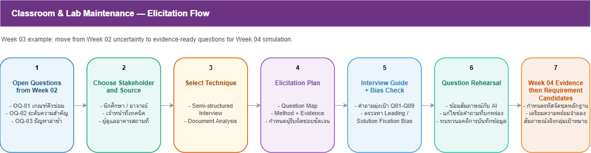

# Week 03 — Elicitation Plan

> **Team:** Group 02 — Classroom & Laboratory Maintenance Reporting System (CLMRS)  
> **Case:** ระบบแจ้งซ่อมอุปกรณ์ในห้องเรียนและห้องปฏิบัติการ  
> **Version:** v0.1  
> **Last updated:** 20/07/2026

---

## 1. Learning Goals

ใน Week 02 ทีมได้ระบุ Open Questions หลายประเด็นเกี่ยวกับกระบวนการแจ้งซ่อมและติดตามงานบำรุงรักษา งานของ Week 03 คือการวางแผนเก็บข้อมูล โดยกำหนด **ผู้ให้ข้อมูล วิธีการเก็บข้อมูล หลักฐานที่คาดว่าจะได้รับ และผู้รับผิดชอบ** เพื่อให้สามารถตรวจสอบและยืนยันความต้องการของระบบได้ใน Week 04

| ID | Open Question / Assumption | Why it matters | Priority |
|---|---|---|---|
| OQ-01 | เกณฑ์ใดใช้กำหนดว่างานเป็นงานเร่งด่วน (Urgent)? | ใช้กำหนดลำดับความสำคัญของงานซ่อม | High |
| OQ-02 | ใครเป็นผู้รับผิดชอบและผู้ยืนยันการปิดงานซ่อม? | ใช้กำหนด Workflow และบทบาทของผู้ใช้งาน | High |
| OQ-03 | หากพบการแจ้งปัญหาซ้ำ ระบบควรจัดการอย่างไร? | ลดงานซ้ำและเพิ่มประสิทธิภาพการดำเนินงาน | High |
| OQ-04 | ผู้ใช้งานต้องการรับการแจ้งเตือนผ่านช่องทางใด? | ออกแบบการติดตามสถานะงาน | Medium |
| OQ-05 | ผู้บริหารต้องการรายงานหรือสถิติประเภทใดบ้าง? | สนับสนุนการวางแผนและการตัดสินใจ | Medium |
| OQ-06 | กรณีส่งต่องานไปหลายหน่วยงาน ควรติดตามสถานะอย่างไร? | รองรับ Workflow การประสานงาน | Medium |

---

## 2. Elicitation Plan

> **Source:** [`w03-elicitation-flow.drawio`](../diagrams/w03-elicitation-flow.drawio)

| ID | Stakeholder / Source | Method | Goal | Expected Evidence | Team Role | Timing | Risk & Mitigation |
|---|---|---|---|---|---|---|---|
| EP-01 | เจ้าหน้าที่เทคนิค | Semi-structured Interview + Workflow Walkthrough | ศึกษาขั้นตอนรับแจ้งซ่อม การจัดลำดับงาน และการปิดงาน | Workflow การทำงาน เกณฑ์ Priority และตัวอย่างงานจริง | Member A: Interviewer Member B: Note-taker | Week 04 | เตรียมคำถาม Follow-up และขอตัวอย่างเหตุการณ์จริง |
| EP-02 | นักศึกษา / ผู้ใช้งานห้อง | Interview | ศึกษาวิธีแจ้งปัญหา Pain Points และความต้องการติดตามสถานะ | ขั้นตอนการแจ้งปัญหา ช่องทางที่ใช้ และปัญหาที่พบ | Member B: Interviewer Member C: Note-taker | Week 04 | เริ่มจากประสบการณ์จริงก่อนเสนอแนวทางแก้ไข |
| EP-03 | อาจารย์ผู้สอน | Interview | ศึกษาผลกระทบต่อการเรียนการสอนและความเร่งด่วนของปัญหา | ตัวอย่างเหตุการณ์ ผลกระทบ และความต้องการติดตามงาน | Member C: Interviewer Member A: Note-taker | Week 04 | ใช้คำถามปลายเปิดเพื่อหลีกเลี่ยงการชี้นำ |
| EP-04 | ผู้ดูแลอาคาร / ผู้บริหาร | Interview + Document Review | ศึกษาการติดตามภาพรวมงานซ่อม รายงาน และตัวชี้วัดที่ต้องการ | KPI รายงาน สถิติ และเกณฑ์การประเมินผล | Member D: Interviewer Member B: Note-taker | Week 04 | หากข้อมูลไม่ครบ ให้บันทึกเป็น Open Issue |
| EP-05 | Interview Notes + Team Discussion | Workshop / Cross-check | เปรียบเทียบข้อมูลจาก Stakeholders ทุกกลุ่ม | ข้อขัดแย้ง ข้อยกเว้น และ Requirement Candidates | ทุกคน | หลังการสัมภาษณ์ | แยก Fact, Opinion และ Assumption ก่อนสรุปผล |

---

## 3. Technique Selection Rationale

### Why Interview?

การสัมภาษณ์เหมาะสำหรับการค้นหาขั้นตอนการทำงานจริง (Workflow) ปัญหาที่พบ (Pain Points) เหตุผลในการตัดสินใจ และข้อยกเว้นต่าง ๆ ซึ่งไม่สามารถทราบได้จากเอกสารเพียงอย่างเดียว

### Why Document Review?

การศึกษาประกาศ ระเบียบ หรือเอกสารที่เกี่ยวข้องกับการแจ้งซ่อมและการบำรุงรักษา ช่วยตรวจสอบความถูกต้องของข้อมูลที่ได้รับจากการสัมภาษณ์ และค้นหากฎหรือข้อกำหนดที่มีอยู่เดิม

### Why Workflow Walkthrough?

การให้ Stakeholder อธิบายเหตุการณ์จริงตั้งแต่เริ่มแจ้งปัญหาจนถึงการปิดงาน ช่วยให้ทีมเข้าใจลำดับขั้นตอน จุดตัดสินใจ และข้อยกเว้นที่อาจเกิดขึ้นระหว่างการดำเนินงาน

### Why not use Questionnaire as the main technique?

แบบสอบถามเหมาะกับการเก็บข้อมูลจากผู้ใช้จำนวนมาก แต่ในช่วงเริ่มต้นทีมยังต้องเข้าใจ Workflow และรายละเอียดของกระบวนการทำงาน จึงเลือกการสัมภาษณ์เป็นวิธีหลัก

---

## 4. Readiness for Week 04 Simulation

### Stakeholder Roles Needed

1. นักศึกษา / ผู้ใช้งานห้อง
2. อาจารย์ผู้สอน
3. เจ้าหน้าที่เทคนิค
4. ผู้ดูแลอาคาร / ผู้บริหาร

### Material Needed

- Stakeholder Role Cards
- Open Questions จาก Week 02
- Interview Guide จาก Week 03
- ตัวอย่างสถานการณ์ เช่น
  - แจ้งอุปกรณ์เสียระหว่างการเรียน
  - การแจ้งปัญหาซ้ำ
  - งานเร่งด่วน
  - การส่งต่องานหลายหน่วยงาน

### Planned Note-taking Format

- Evidence ID
- Stakeholder
- Statement / Observation
- Evidence Type
- Related Open Question
- Initial Interpretation

โดยแยกข้อมูลเป็น

- Fact
- Opinion
- Assumption
- Suggestion

อย่างชัดเจน

### Team Agreement

- Interviewer ใช้คำถามตาม Interview Guide และสามารถถาม Follow-up ได้เมื่อจำเป็น
- Note-taker บันทึกข้อมูลตามข้อเท็จจริงโดยไม่ตีความเป็น Requirement
- ทุกคนช่วยตรวจสอบว่าคำถามไม่เป็นคำถามชี้นำ (Leading Question)
- ก่อนจบการสัมภาษณ์ จะสรุปข้อมูลกลับให้ผู้ให้สัมภาษณ์ยืนยันความถูกต้อง
