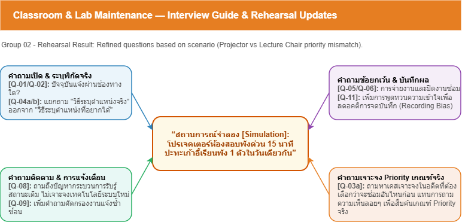

# Week 03 — Interview Guide and Bias Check

> **Team:** Group 02 — Classroom & Laboratory Maintenance Reporting System  
> **Case:** ระบบแจ้งซ่อมอุปกรณ์ในห้องเรียนและห้องปฏิบัติการ (Classroom & Laboratory Maintenance Reporting System)  
> **Target stakeholder(s):** นักศึกษา/ผู้ใช้งานห้อง (Secondary), อาจารย์ผู้สอน (Secondary), เจ้าหน้าที่เทคนิค (Primary), ผู้ดูแลอาคาร/ผู้บริหาร (Supporting)  
> **Version:** v0.1

---

## 1. Opening and Consent Script

> ขอบคุณที่สละเวลาร่วมการสัมภาษณ์ครั้งนี้ พวกเราต้องการศึกษากระบวนการแจ้งซ่อมอุปกรณ์ในห้องเรียนและห้องปฏิบัติการที่ใช้อยู่ในปัจจุบัน เพื่อวิเคราะห์ความต้องการของระบบอย่างเป็นระบบ ข้อมูลที่บันทึกจะใช้เพื่อการเรียนการสอนเท่านั้น และจะไม่เก็บข้อมูลส่วนบุคคลหรือข้อมูลที่สามารถระบุตัวตนได้ เราจะจดเฉพาะขั้นตอนการทำงาน ปัญหา กฎ และข้อเสนอแนะที่เกี่ยวข้องกับกรณีศึกษา หากเราเข้าใจข้อมูลไม่ถูกต้อง เราจะสรุปกลับเพื่อขอให้ช่วยยืนยันก่อนนำไปวิเคราะห์

---

## 2. Interview Questions



> **Source:** [`w03-interview-question-map.drawio`](../diagrams/w03-interview-question-map.drawio)

| ID | Main / Follow-up Question | Type | Why this question is asked | Open Question / Assumption | Expected Evidence |
|---|---|---|---|---|---|
| Q-01 | **[Student / Teacher]** ปัจจุบันเมื่อพบอุปกรณ์เสีย คุณแจ้งปัญหาผ่านช่องทางใด และมีขั้นตอนอย่างไร? | Open | ศึกษา Workflow ปัจจุบันโดยไม่ชี้นำวิธีแก้ไข | OQ-03 | ขั้นตอนการแจ้งปัญหา ช่องทางที่ใช้ และผู้เกี่ยวข้อง |
| Q-02 | **[Student / Teacher / Technician]** ปัญหาหรืออุปสรรคที่พบระหว่างการแจ้งซ่อมหรือการติดตามงานคืออะไร? เพราะอะไรจึงเกิดปัญหานั้น? | Probe | ค้นหา Pain Points และสาเหตุของปัญหา | OQ-03 | ตัวอย่างเหตุการณ์ ความถี่ และผลกระทบ |
| Q-03 | **[Technician]** ข้อมูลใดที่จำเป็นสำหรับการแจ้งซ่อม เพื่อให้สามารถดำเนินการได้ทันที? | Open | ค้นหาข้อมูลที่จำเป็นต่อการปฏิบัติงาน | OQ-02 | รายการข้อมูลที่ใช้จริง เช่น สถานที่ อาการ รูปภาพ รหัสครุภัณฑ์ |
| Q-04 | **[Technician / Manager]** งานลักษณะใดควรจัดเป็นงานเร่งด่วน (Urgent) และใช้เกณฑ์ใดในการจัดลำดับความสำคัญ? | Open + Probe | ศึกษาเกณฑ์ Priority และ SLA | OQ-01 | เกณฑ์การจัดลำดับ ตัวอย่างงานเร่งด่วน และเหตุผล |
| Q-05 | **[Technician / Manager]** ใครควรเป็นผู้ยืนยันว่าการซ่อมเสร็จสิ้น และหากงานต้องส่งต่อหลายหน่วยงานหรือมีการแจ้งปัญหาซ้ำ ควรติดตามและจัดการอย่างไร? | Exception | ศึกษา Workflow การปิดงาน การส่งต่องาน และการจัดการงานซ้ำ | OQ-02, OQ-03, OQ-06 | ขั้นตอนการปิดงาน ผู้รับผิดชอบ แนวทางการส่งต่องาน และการจัดการงานซ้ำ |
| Q-06 | **[Student / Teacher]** หลังจากแจ้งปัญหาแล้ว คุณต้องการรับการแจ้งเตือนหรือทราบความคืบหน้าของงานในรูปแบบใด? | Open | ศึกษาความต้องการด้านการติดตามงานโดยไม่เสนอ Solution | OQ-04 | ช่องทางแจ้งเตือน เวลาที่ต้องการ และข้อมูลที่คาดหวัง |
| Q-07 | **[Manager]** ปัจจุบันติดตามภาพรวมของงานซ่อมและประเมินผลการดำเนินงานอย่างไร? | Open | ศึกษาความต้องการของผู้บริหาร | OQ-05 | รายงาน ตัวชี้วัด และข้อมูลที่ใช้ในการตัดสินใจ |
| Q-08 | **[Manager]** ข้อมูลหรือสถิติใดที่ช่วยให้วางแผนและปรับปรุงการบำรุงรักษาได้ดีขึ้น? | Probe | ศึกษาความต้องการด้าน Dashboard และรายงาน | OQ-05 | KPI รายงาน และข้อมูลที่ใช้จริง |
| Q-09 | **[All]** ขอสรุปว่า... [กล่าวสรุปขั้นตอนหรือกฎที่ได้ยิน] ...ถูกต้องหรือไม่? มีส่วนใดที่ควรแก้ไขหรือเพิ่มเติม? | Validation | ยืนยันความเข้าใจและลด Recording Bias | ทุก OQ | ข้อมูลที่ได้รับการยืนยันหรือแก้ไข |

---

## 3. Bias Check

### 3.1 Team Assumptions to Watch

| Assumption | Risk if Wrong | How the Team Will Test It |
|---|---|---|
| ทุกการแจ้งซ่อมต้องแนบรูปภาพประกอบ | อาจเพิ่มภาระให้ผู้ใช้งานโดยไม่จำเป็น | ถาม Q-03 และ Q-01 |
| ปัญหาทุกประเภทต้องดำเนินการตามลำดับการแจ้ง | ความจริงอาจมีการจัดลำดับตามความเร่งด่วน | ถาม Q-04 |
| การแจ้งปัญหาซ้ำเกิดขึ้นบ่อย | หากไม่จริง อาจออกแบบระบบเกินความจำเป็น | ถาม Q-05 |
| ผู้ใช้ทุกคนต้องการรับการแจ้งเตือนทุกครั้งที่สถานะเปลี่ยน | อาจเกิด Notification มากเกินไป | ถาม Q-06 |
| ผู้บริหารทุกคนต้องการรายงานแบบเดียวกัน | ความต้องการอาจแตกต่างกันตามบทบาท | ถาม Q-07 และ Q-08 |

### 3.2 Questions Rewritten Because They Were Leading

| Original Leading Question | Why it is Problematic | Revised Question |
|---|---|---|
| "ระบบควรแจ้งเตือนทุกครั้งที่สถานะเปลี่ยนใช่ไหม?" | ชี้นำให้ผู้ตอบเห็นด้วยกับแนวทางแก้ไข | "หลังจากแจ้งปัญหาแล้ว คุณต้องการรับการแจ้งเตือนหรือทราบความคืบหน้าของงานในรูปแบบใด?" |
| "ทุกงานเร่งด่วนควรได้รับการซ่อมก่อนใช่หรือไม่?" | สมมติวิธีจัดลำดับงานไว้ล่วงหน้า | "งานลักษณะใดควรจัดเป็นงานเร่งด่วน และใช้เกณฑ์ใดในการจัดลำดับ?" |
| "การแนบรูปภาพทุกครั้งน่าจะช่วยให้ซ่อมเร็วขึ้นใช่ไหม?" | เสนอวิธีแก้ก่อนทราบความต้องการจริง | "ข้อมูลหรือหลักฐานใดที่จำเป็น เพื่อให้สามารถดำเนินการซ่อมได้รวดเร็ว?" |

### 3.3 Information Still Without Evidence

- เกณฑ์การกำหนดงานเร่งด่วน (Urgent)
- ผู้รับผิดชอบในการยืนยันการปิดงาน
- แนวทางการจัดการกรณีแจ้งปัญหาซ้ำ
- แนวทางการติดตามงานที่ถูกส่งต่อหลายหน่วยงาน
- ช่องทางและช่วงเวลาที่เหมาะสมสำหรับการแจ้งเตือน
- รายงานและตัวชี้วัดที่ผู้ดูแลอาคารหรือผู้บริหารต้องการ

### 3.4 How the Team Will Avoid Bias

1. เริ่มด้วยคำถามเปิดเกี่ยวกับขั้นตอนการทำงานจริงก่อนพูดถึงแนวทางแก้ไข
2. บันทึกข้อเท็จจริงและระบุแหล่งที่มาของข้อมูลทุกครั้ง
3. แยกข้อมูลที่ Stakeholder ให้มาออกจากการตีความของทีม
4. สรุปข้อมูลกลับให้ผู้ให้สัมภาษณ์ยืนยันก่อนจบการสัมภาษณ์
5. เปรียบเทียบข้อมูลจาก Stakeholders หลายกลุ่มก่อนสรุปเป็น Requirement

---

## 4. Question Rehearsal Revision

| Question ID | What Happened in Rehearsal | What Was Unclear / Leading | Revision Made |
|---|---|---|---|
| Q-03 | ผู้ตอบให้ข้อมูลไม่ครบว่าต้องใช้ข้อมูลอะไรในการรับงาน | คำถามยังไม่ขอตัวอย่างข้อมูลจริง | เพิ่มคำถามติดตาม "ช่วยยกตัวอย่างข้อมูลที่จำเป็นจากเหตุการณ์ล่าสุดได้หรือไม่?" |
| Q-04 | ผู้ตอบให้ความหมายของ "งานเร่งด่วน" แตกต่างกัน | ยังไม่ทราบเกณฑ์ที่ใช้จริง | เพิ่มคำถามติดตาม "ช่วยยกตัวอย่างงานเร่งด่วนที่เคยเกิดขึ้นได้หรือไม่?" |
| Q-05 | ผู้ตอบกล่าวถึงการส่งต่องาน แต่ไม่ได้อธิบายผู้รับผิดชอบ | Workflow ยังไม่ชัดเจน | เพิ่มคำถามติดตาม "ใครเป็นผู้ตัดสินใจส่งต่องาน และใครเป็นผู้ปิดงาน?" |
| Q-06 | ผู้ตอบเริ่มเสนอว่าอยากใช้ LINE Notify | เสี่ยงต่อ Solution Bias หากบันทึกเป็น Requirement | เพิ่มคำถาม "ปัจจุบันมีปัญหาอะไรกับการติดตามสถานะ และเวลาใดที่ต้องการทราบข้อมูลมากที่สุด?" |
| Q-08 | ผู้ตอบเสนอช่องทางการแจ้งเตือนที่ต้องการ | เสี่ยงต่อ Solution Bias เพราะเป็นการเสนอวิธีแก้ไขก่อนทราบปัญหาที่แท้จริง | เพิ่มคำถาม: "ปัจจุบันคุณติดตามสถานะงานอย่างไร?" และ "ปัญหาที่พบจากวิธีปัจจุบันคืออะไร?" |
```
