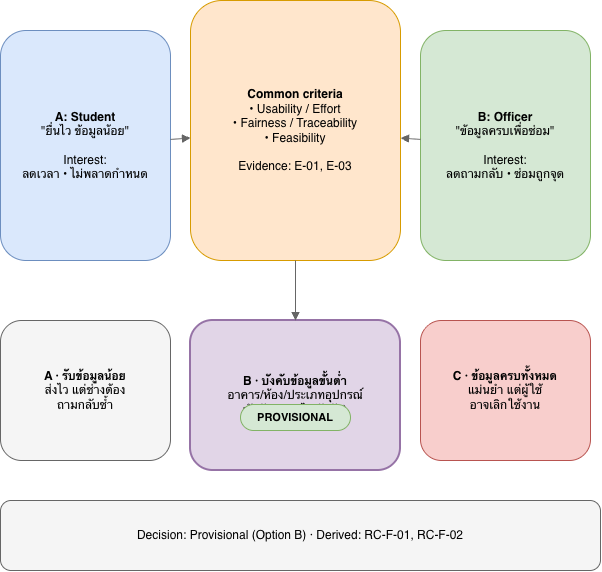

# Week 04 — Conflict and Negotiation Record

**Status rule:** ผลการเจรจาใน controlled simulation เป็น Candidate/Provisional/Unresolved เท่านั้น

## 1. Negotiation method
แยก Position/Interest, พิจารณา Authority/Constraint และประเมิน Option ด้วยเกณฑ์ Usability, Effort, Fairness, Traceability, Feasibility

## 2. Negotiation register

### N-01 — Quick submission vs Complete information (E-01, E-03)
*   **A (Student):** ยื่นไว ข้อมูลน้อย
*   **B (Officer):** ข้อมูลครบเพื่อซ่อม
*   **ตัดสินใจ:** **Provisional (Option B)** บังคับฟิลด์ขั้นต่ำ (อาคาร, ห้อง, ประเภทอุปกรณ์) เพื่อสมดุลการใช้งานจริง (E-01/E-03)
*   **Unresolved:** รายชื่อ Dropdown, ขนาดไฟล์ภาพ
*   **Derived:** RC-F-01, RC-F-02

### N-02 — Automatic screening vs Manual merge (E-04)
*   **A (Student):** ส่งไว ไม่เช็กซ้ำ
*   **B (Officer):** บล็อกซ้ำ
*   **ตัดสินใจ:** **Provisional (Option B)** แจ้งเตือน Pop-up แต่ยอมให้ส่ง แล้วใช้ฟังก์ชัน Merge ตั๋วซ้ำ (E-04)
*   **Unresolved:** Time Window ของตั๋วซ้ำ, UI การ Merge
*   **Derived:** RC-F-06

### N-03 — Work assignment control and final close (E-05, E-07)
*   **A (Officer):** ช่างปิดงานได้เอง
*   **B (Manager):** หัวหน้าตรวจสอบก่อนปิด
*   **ตัดสินใจ:** **Unresolved (Option B)** เสนอโครงสร้างช่างบันทึก ➔ หัวหน้าอนุมัติปิดเคส (Two-tier) เพื่อคุณภาพงาน (E-07)
*   **Unresolved Owner:** Building Manager
*   **Derived:** RC-F-05, RC-F-07

## 3. Decision summary

| N-ID | Status | Accepted direction | Next owner |
| :---: | :---: | :--- | :--- |
| **N-01** | Prov. | บังคับข้อมูลหลัก, ไม่บังคับภาพ | ทีมพัฒนา |
| **N-02** | Prov. | แจ้งเตือน+Merge ตั๋วซ้ำ | ทีมพัฒนา |
| **N-03** | Unres.| ช่างบันทึก➔หัวหน้าปิด | Building Manager |

## 4. Quality check
- [x] มี E-ID อ้างอิง และตัวเลือก > 2
- [x] แยก Position/Interest ชัดเจน
- [x] สถานะถูกต้อง (Provisional/Unresolved)
- [x] กำหนด Next Owner สำหรับข้อที่ Unresolved
