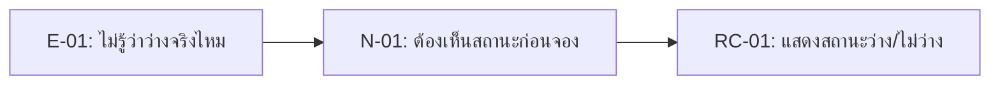

# 04 — Requirement Candidates: Campus Resource Booking

## 1. How We Turned Evidence into Requirement Candidates

หลักคิดของทีม:

1. เริ่มจาก evidence ที่มี E-ID
2. เขียน need เป็นปัญหา/เป้าหมายของ stakeholder
3. เขียน RC เป็น capability ของระบบ
4. ใส่ status เป็น `Candidate` หรือ `Needs Validation`
5. ระบุ follow-up ถ้ายังมี unknown

## 2. Requirement Candidate Table

| RC-ID | ข้อกำหนดระบบเบื้องต้น | ผู้มีส่วนได้ส่วนเสีย / ความต้องการ | หลักฐานอ้างอิง | สถานะ |
| :--- | :--- | :--- | :--- | :--- |
| **RC-01** | แจ้งซ่อมผ่านระบบ | นศ., อาจารย์ | E-01 | Candidate |
| **RC-02** | บังคับระบุข้อมูล | ช่าง | E-02, E-03 | Candidate |
| **RC-03** | จัดลำดับความสำคัญ | ช่าง, บริหาร | E-04 | Needs Validation |
| **RC-04** | ติดตามสถานะงาน | นศ., อาจารย์ | E-05 | Candidate |
| **RC-05** | บันทึกผลและปิดงาน | ช่าง | E-03 | Needs Validation |
| **RC-06** | จัดการงานซ้ำซ้อน | ช่าง | E-01, E-03 | Needs Validation |
| **RC-07** | ติดตามงานโอนย้าย | ช่าง, บริหาร | E-06 | Needs Validation |
| **RC-08** | ออกรายงานและสถิติ | บริหาร | E-07 | Needs Validation |

## 3. Why These Are Candidates, Not Final Requirements

| RC | เหตุผลที่ยังไม่ final |
|---|---|
| RC-01 | ยังไม่รู้ว่า availability จะ sync จากแหล่งข้อมูลใด |
| RC-03 | ยังไม่รู้กฎวันคืนและวิธีแจ้งเตือน |
| RC-05 | ยังไม่รู้ authority ที่อนุมัติ exception จริง |

## 4. Candidate to Week05 Backlog Handoff

| Week04 RC | Move to Week05? | Reason |
|---|---|---|
| RC-01 | Yes | Evidence ชัดและเป็น core flow |
| RC-02 | Yes | ช่วยลดการถามเจ้าหน้าที่ซ้ำ |
| RC-03 | Yes, revise after validation | ต้องยืนยัน rule วันคืน |
| RC-04 | Yes | เป็น constraint จากเจ้าหน้าที่ |
| RC-05 | Revise | ต้องถามผู้มีอำนาจก่อนเขียนให้ชัด |

## 5. Student Takeaway

ตัวอย่างนี้แสดงว่า RC ที่ดีควรตอบได้ว่า:

- อ้าง evidence ไหน
- แก้ need อะไร
- ยังไม่รู้อะไร
- จะตรวจต่อใน Week05 อย่างไร แก้เป็นงานของฉัน
