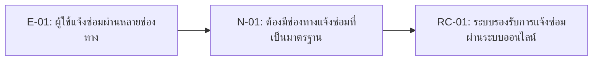

# 04 — Requirement Candidates: Classroom & Laboratory Maintenance Reporting System

## 1. How We Turned Evidence into Requirement Candidates

หลักคิดของทีม:

1. เริ่มจากหลักฐาน (Evidence) ที่มี Evidence ID (E-ID)
2. วิเคราะห์ความต้องการ (Need) จากปัญหาหรือข้อจำกัดที่ Stakeholder ให้ข้อมูล
3. แปลง Need เป็น Requirement Candidate ของระบบ
4. ระบุสถานะเป็น `Candidate` หรือ `Needs Validation`
5. หากยังไม่มีหลักฐานเพียงพอ จะบันทึกไว้เป็น Follow-up สำหรับ Week 05

---

## 2. Requirement Candidate Table

| RC-ID | ข้อกำหนดระบบเบื้องต้น | ผู้มีส่วนได้ส่วนเสีย / ความต้องการ | หลักฐานอ้างอิง | สถานะ |
| :--- | :--- | :--- | :--- | :--- |
| **RC-01** | แจ้งซ่อมผ่านระบบ | นศ., อาจารย์ | E-01 | Candidate |
| **RC-02** | บังคับระบุข้อมูล | ช่าง | E-02, E-03 | Candidate |
| **RC-03** | จัดลำดับความสำคัญ | ช่าง, บริหาร | E-04 | Needs Validation |
| **RC-04** | ติดตามสถานะงาน | นศ., อาจารย์ | E-05 | Candidate |
| **RC-05** | บันทึกผลและปิดงาน | ช่าง | E-03 | Needs Validation |
| **RC-06** | จัดการงานซ้ำซ้อน | ช่าง | E-01, E-03 | Needs Validation |
| **RC-07** | ติดตามงานโอนย้าย | ช่าง, บริหาร | E-06 | Needs Validation |
| **RC-08** | ออกรายงานและสถิติ | บริหาร | E-07 | Needs Validation |

## 3. Why These Are Candidates, Not Final Requirements

| RC | เหตุผลที่ยังไม่เป็น Final Requirement |
|---|---|
| RC-03 | ยังไม่มีหลักฐานยืนยันเกณฑ์การกำหนดงานเร่งด่วน (Urgent) |
| RC-05 | ยังไม่ทราบผู้รับผิดชอบในการยืนยันและปิดงานซ่อม |
| RC-06 | ยังไม่มีข้อสรุปเกี่ยวกับการจัดการกรณีแจ้งปัญหาซ้ำ |
| RC-07 | ยังไม่ทราบขั้นตอนการติดตามงานที่ส่งต่อหลายหน่วยงาน |
| RC-08 | ยังไม่ยืนยันว่าผู้บริหารต้องการรายงานหรือ KPI ประเภทใด |

---

## 4. Candidate to Week 05 Backlog Handoff

| Week 04 RC | Move to Week 05? | Reason |
|---|---|---|
| RC-01 | Yes | เป็นความสามารถหลักของระบบ |
| RC-02 | Yes | มีหลักฐานสนับสนุนจากหลาย Stakeholders |
| RC-03 | Yes, revise after validation | ต้องยืนยันเกณฑ์ Urgent |
| RC-04 | Yes | สอดคล้องกับ Pain Point ของผู้ใช้งาน |
| RC-05 | Revise | ต้องยืนยัน Workflow การปิดงาน |
| RC-06 | Revise | ต้องหาหลักฐานเกี่ยวกับการแจ้งปัญหาซ้ำ |
| RC-07 | Revise | ต้องยืนยันการส่งต่องานหลายหน่วยงาน |
| RC-08 | Revise | ต้องสอบถามผู้บริหารเพิ่มเติม |

---

## 5. Student Takeaway

Requirement Candidate ที่ดีควรสามารถอธิบายได้ว่า

- อ้างอิงหลักฐาน (Evidence) ใด
- ตอบสนอง Need ของ Stakeholder ใด
- ยังมีข้อมูลใดที่ต้องตรวจสอบเพิ่มเติม
- จะนำไปตรวจสอบและปรับปรุงใน Week 05 อย่างไร
