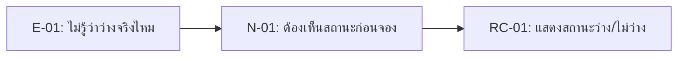

# 04 — Requirement Candidates: Campus Resource Booking

## 1. How We Turned Evidence into Requirement Candidates

หลักคิดของทีม:

1. เริ่มจาก evidence ที่มี E-ID
2. เขียน need เป็นปัญหา/เป้าหมายของ stakeholder
3. เขียน RC เป็น capability ของระบบ
4. ใส่ status เป็น `Candidate` หรือ `Needs Validation`
5. ระบุ follow-up ถ้ายังมี unknown

## 2. Requirement Candidate Table

| RC-ID | Requirement Candidate | Stakeholder / Need | Evidence E-ID(s) | Status | Follow-up |
|---|---|---|---|---|---|
| RC-01 | ระบบควรแสดงสถานะความพร้อมใช้งานของห้องเรียนและอุปกรณ์การเรียนก่อนที่ผู้ใช้จะส่งคำขอจอง | Student Requester / N-01 | E-01 | Candidate | Verify source of availability status |
| RC-02 | ระบบควรอนุญาตให้ผู้ใช้ค้นหาและกรองทรัพยากรตามประเภทและความพร้อมใช้งาน เพื่อให้พวกเขาสามารถเลือกทรัพยากรที่เหมาะสมก่อนที่จะร้องขอ | Student Requester / N-02 | E-02 | Candidate | Confirm search/filter fields |
| RC-03 | ระบบควรแสดงวันที่/เวลาที่คาดว่าจะส่งคืนอุปกรณ์ที่ยืมไปให้ทั้งผู้ขอใช้และเจ้าหน้าที่ผู้รับผิดชอบ | Student Requester, Resource Officer / N-03 | E-03 | Candidate | Confirm due-date rule |
| RC-04 | ระบบควรขอข้อมูลการจองขั้นต่ำก่อนที่จะส่งคำขอเพื่อตรวจสอบ | Resource Officer / N-04 | E-04 | Candidate | Confirm required fields |
| RC-05 | ระบบควรระบุคำขอเร่งด่วนหรือคำขอที่มีตารางเวลาขัดแย้งว่าจำเป็นต้องได้รับการตรวจสอบจากผู้จัดการ/ผู้สอนก่อนอนุมัติ | Resource Officer / N-05 | E-05 | Needs Validation | Confirm approval authority |

## 3. Why These Are Candidates, Not Final Requirements

| RC | เหตุผลที่ยังไม่ final |
|---|---|
| RC-01 | ยังไม่รู้ว่า availability จะ sync จากแหล่งข้อมูลใด |
| RC-03 | ยังไม่รู้กฎวันคืนและวิธีแจ้งเตือน |
| RC-05 | ยังไม่รู้ authority ที่อนุมัติ exception จริง |

## 4. Candidate to Week05 Backlog Handoff

| Week04 RC | Move to Week05? | Reason |
|---|---|---|
| RC-01 | Yes | Evidence ชัดและเป็น core flow |
| RC-02 | Yes | ช่วยลดการถามเจ้าหน้าที่ซ้ำ |
| RC-03 | Yes, revise after validation | ต้องยืนยัน rule วันคืน |
| RC-04 | Yes | เป็น constraint จากเจ้าหน้าที่ |
| RC-05 | Revise | ต้องถามผู้มีอำนาจก่อนเขียนให้ชัด |

## 5. Student Takeaway

ตัวอย่างนี้แสดงว่า RC ที่ดีควรตอบได้ว่า:

- อ้าง evidence ไหน
- แก้ need อะไร
- ยังไม่รู้อะไร
- จะตรวจต่อใน Week05 อย่างไร แก้เป็นงานของฉัน
