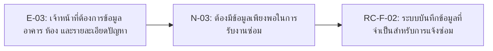

# 04 — Requirement Candidates: Classroom & Laboratory Maintenance Reporting System

> **Version:** v0.2 (แก้คอลัมน์ Stakeholder/Need และ Evidence E-ID(s) ให้ตรงกับ Need Summary ใน `04-evidence-log.md` — เดิม Need ID ถูกใส่ตามลำดับแถวเฉยๆ ไม่ตรงเนื้อหา และ E-04 ถูกใช้ซ้ำเป็นหลักฐานให้ RC 4 ตัวโดยไม่ถูกต้อง)

## 1. How We Turned Evidence into Requirement Candidates

หลักคิดของทีม:

1. เริ่มจาก Evidence ที่มี Evidence ID (E-ID)
2. วิเคราะห์ความต้องการ (Need) ของ Stakeholder จากหลักฐาน
3. แปลง Need เป็น Candidate Requirement ของระบบ
4. กำหนดสถานะเป็น `Candidate` หรือ `Needs Validation`
5. ระบุประเด็นที่ยังต้องตรวจสอบเพิ่มเติม (Follow-up)

```mermaid
flowchart LR
    E["E-03: เจ้าหน้าที่ต้องการข้อมูล อาคาร ห้อง และรายละเอียดปัญหา"] --> N["N-03: ต้องมีข้อมูลเพียงพอในการรับงานซ่อม"]
    N --> R["RC-F-02: ระบบบันทึกข้อมูลที่จำเป็นสำหรับการแจ้งซ่อม"]
```

---

# 2. Requirement Candidate Table

| RC-ID | Requirement Candidate | Stakeholder / Need | Evidence E-ID(s) | Status | Follow-up |
|---|---|---|---|---|---|
| RC-F-01 | ระบบควรให้ผู้ใช้งานแจ้งปัญหาอุปกรณ์หรือห้องเรียนที่ชำรุดผ่านระบบได้ | นักศึกษา / อาจารย์ (N-01) | E-01 | Candidate | ตรวจสอบช่องทางการแจ้งปัญหาที่เหมาะสม |
| RC-F-02 | ระบบควรบันทึกข้อมูลที่จำเป็นสำหรับการแจ้งซ่อม เช่น อาคาร ห้อง รายละเอียดปัญหา และรูปภาพประกอบ (ถ้ามี) | เจ้าหน้าที่เทคนิค (N-03) | E-03 | Candidate | ยืนยันรายการข้อมูลขั้นต่ำที่ต้องใช้ |
| RC-F-03 | ระบบควรสนับสนุนการจัดลำดับความสำคัญของงานซ่อมตามระดับความเร่งด่วน (Urgent) | อาจารย์ผู้สอน / เจ้าหน้าที่เทคนิค (N-02) | E-02 | Needs Validation | ยืนยันเกณฑ์การกำหนดระดับความเร่งด่วน |
| RC-F-04 | ระบบควรให้ผู้ใช้งานสามารถติดตามสถานะของรายการแจ้งซ่อมของตนเองได้ | นักศึกษา / อาจารย์ (N-05) | E-05 | Candidate | ยืนยันสถานะที่ผู้ใช้ต้องการติดตาม |
| RC-F-05 | ระบบควรให้เจ้าหน้าที่บันทึกผลการดำเนินงานและปิดงานซ่อมได้ | เจ้าหน้าที่เทคนิค (ยังไม่มี Need ID จาก Evidence Log — มาจาก Negotiation N-03 เท่านั้น) | ยังไม่มี (รอ Evidence — ดู OQ-02) | Needs Validation | ยืนยันผู้รับผิดชอบในการปิดงาน และเก็บ Evidence เพิ่มเติมเพื่อปิด gap |
| RC-F-06 | ระบบควรช่วยตรวจสอบหรือแจ้งเตือนกรณีมีการแจ้งปัญหาซ้ำของอุปกรณ์หรือห้องเดียวกัน | เจ้าหน้าที่เทคนิค (N-04) | E-04 | Needs Validation | ยืนยันแนวทางการจัดการรายการแจ้งซ้ำ |
| RC-F-07 | ระบบควรสนับสนุนการติดตามสถานะของงานที่มีการส่งต่อระหว่างหลายหน่วยงาน | เจ้าหน้าที่เทคนิค / ผู้ดูแลอาคาร (N-07) | E-07 | Needs Validation | ยืนยัน Workflow การส่งต่องาน |
| RC-F-08 | ระบบควรแสดงรายงานและสถิติการแจ้งซ่อม เพื่อสนับสนุนการติดตามและการตัดสินใจของผู้บริหาร | ผู้ดูแลอาคาร / ผู้บริหาร (N-06) | E-06 | Needs Validation | ยืนยันรูปแบบรายงานและตัวชี้วัดที่ต้องการ |

---

# 3. Why These Are Candidates, Not Final Requirements

| RC | เหตุผลที่ยังไม่เป็น Requirement สุดท้าย |
|---|---|
| RC-F-03 | ยังไม่ทราบเกณฑ์ที่ใช้กำหนดว่างานใดเป็นงานเร่งด่วน (Urgent) |
| RC-F-05 | ยังไม่ยืนยันว่าใครเป็นผู้รับผิดชอบในการปิดงานและยืนยันการซ่อม และยังไม่มี Evidence E-ID ใน Evidence Log รองรับโดยตรง (มาจาก Negotiation N-03 เท่านั้น) |
| RC-F-06 | ยังไม่มีข้อสรุปว่าจะจัดการกรณีแจ้งปัญหาซ้ำอย่างไร |
| RC-F-07 | ยังต้องศึกษาการติดตามงานเมื่อมีการส่งต่อหลายหน่วยงาน |
| RC-F-08 | ยังต้องยืนยันประเภทของรายงานและสถิติที่ผู้บริหารต้องการ |

---

# 4. Candidate to Week 05 Backlog Handoff

| Week 04 RC | Move to Week 05? | Reason |
|---|---|---|
| RC-F-01 | Yes | เป็นความสามารถหลักของระบบ |
| RC-F-02 | Yes | ข้อมูลการแจ้งซ่อมเป็นหัวใจของระบบ |
| RC-F-03 | Revise | ต้องยืนยันเกณฑ์ Urgent |
| RC-F-04 | Yes | ผู้ใช้งานต้องการติดตามสถานะงาน |
| RC-F-05 | Revise | ต้องยืนยัน Workflow การปิดงาน |
| RC-F-06 | Revise | ต้องยืนยันแนวทางจัดการรายการแจ้งซ้ำ |
| RC-F-07 | Revise | ต้องยืนยันขั้นตอนการส่งต่องาน |
| RC-F-08 | Revise | ต้องยืนยันความต้องการด้านรายงานของผู้บริหาร |

---

# 5. Student Takeaway

Requirement Candidate ที่ดีควรสามารถอธิบายได้ว่า

- อ้างอิงมาจาก Evidence (E-ID) ใด
- ตอบสนองความต้องการ (Need) ของ Stakeholder ใด
- ยังมีข้อมูลใดที่ต้องตรวจสอบเพิ่มเติม
- จะนำไปตรวจสอบและปรับปรุงใน Week 05 อย่างไร